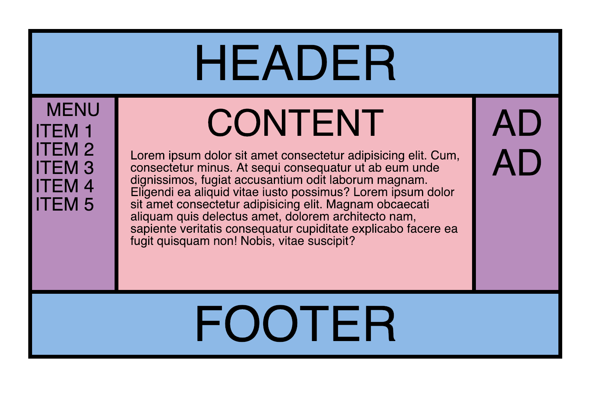
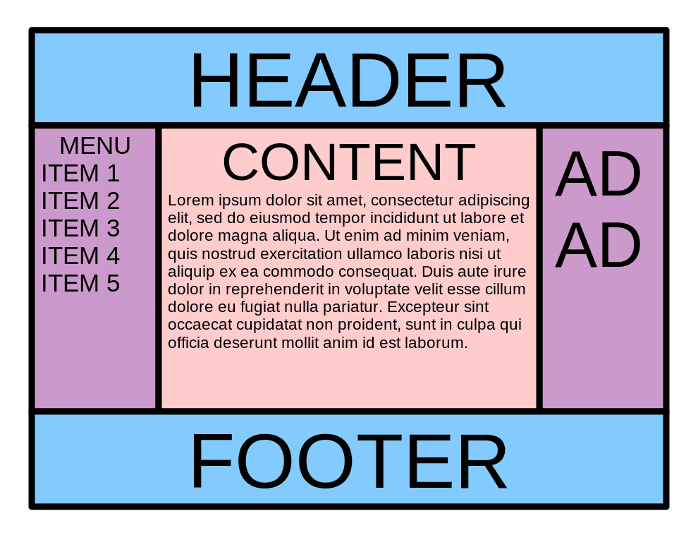

# Flexbox Warmup

<<<<<<< HEAD

### See it live

http://flexbox-warmup-dylanattal.surge.sh/

### Summary

This was just a quick practice of CSS flexbox. My assignment was to recreate the below image as closely as possible.

### Project Goals

- [x] Recreate the given image as closely as possible
- [x] Utilize CSS flexbox to create rows and columns and to center text
- [x] Match colors and fonts

### Technologies Used

HTML, CSS
=======
ASSIGNMENT: Recreate the below design to the best of your ability using flexbox.

>>>>>>> 7a338066c42c00d96bab1a08939c8047cead80c4
